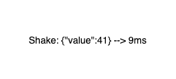

# yomo-cluing-shake





## 如何运行

### 先决条件

[Install Go](https://golang.org/doc/install)

注意：如果发现有下载安装不了的情况，需要配置一下自已http代理:

```bash
export http_proxy=http://{ProxyIP}:{ProxyPort};export https_proxy=http://{ProxyIP}:{ProxyPort};
```


### 1. Clone Repository

```bash 
$ git clone https://github.com/yomorun/yomo-cluing-shake.git
$ go get ./...
```

### 2. 安装YoMo CLI

```bash
$ go install github.com/yomorun/cli/yomo@latest
```

执行下面的命令，确保yomo已经在环境变量中，有任何问题请参考 [YoMo 的详细文档](https://github.com/yomorun/yomo)

```bash
$ yomo version
YoMo CLI version: v0.0.6
```

当然也可以直接下载可执行文件: [yomo-v0.0.6-x86_64-linux.tgz](https://github.com/yomorun/cli/releases/download/v0.0.6/yomo-v0.0.6-x86_64-linux.tgz)

### 3. 运行shake-zipper

```bash
$ yomo serve -c ./zipper/workflow.yaml
# 如果是本地调试，可以运行 `make debug_zipper`
```

### 4. 运行shake-flow

```bash
$ go run ./flow/app.go
# 如果是本地调试，可以运行 `make debug_flow`
```

### 5. 运行shake-sink

```bash
$ go run ./sink/main.go
# 如果是本地调试，可以运行 `make debug_sink`
# 访问 http://localhost:8000/public/ 查看效果
```

### 6. 运行shake-source

```bash
$ go run ./source/main.go
# 如果是本地调试，可以运行 `make debug_source`
```

### 7. 运行emitter

```bash
$ go run ./cmd/emitter/main.go
# 如果是本地调试，可以运行 `make debug_emitter`
```

